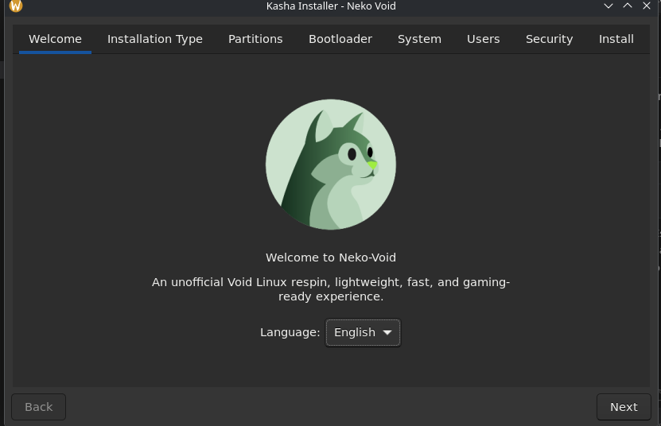
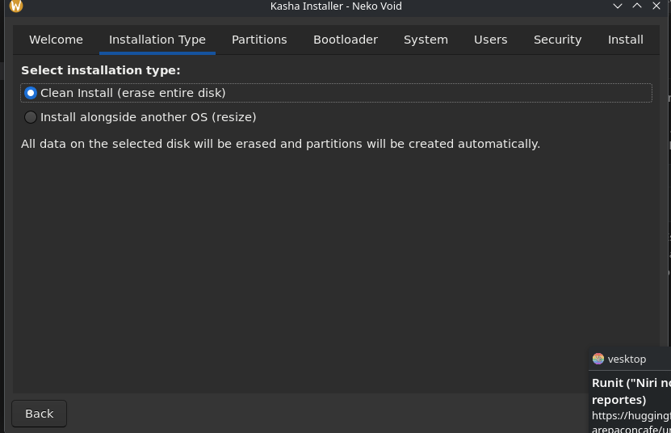
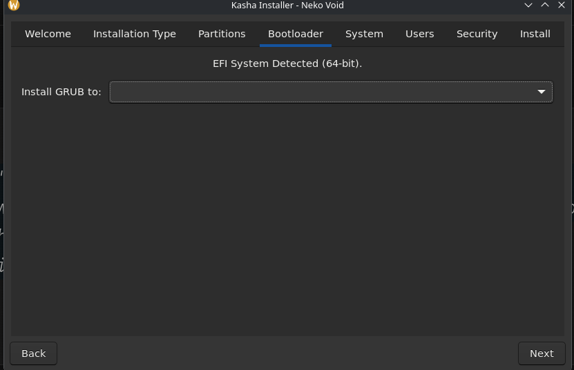
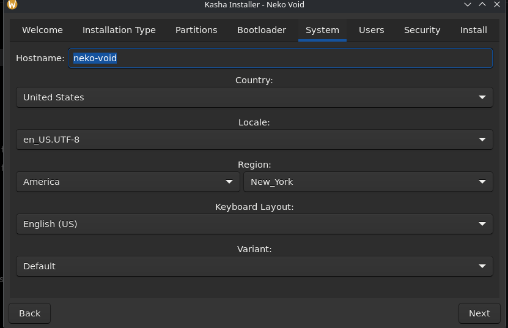
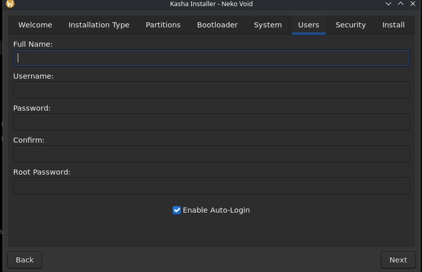

<p align="center">
  
</p>

<p align="center">
  <a href="https://codeberg.org/javiercplus/Kasha-Installer">
    
  </a>
  <a href="https://codeberg.org/javiercplus/Kasha-Installer/releases">
    
  </a>
  <a href="https://codeberg.org/javiercplus/Kasha-Installer/src/branch/main/LICENSE">
    
  </a>
</p>
<p align="center">
  <strong>A modular, fast, and feature-rich Linux system installer built with C and GTK+ 3.0.</strong>
</p>
<p align="center">
  <a href="#features">Features</a> •
  <a href="#usage">Usage</a> •
  <a href="#installation">Installation</a> •
  <a href="#customization">Customization</a> •
  <a href="#troubleshooting">Troubleshooting</a> •
  <a href="#development">Development</a>
</p>

---

Kasha Installer provides a seamless graphical interface for deploying Linux distributions. Originally designed for custom Void Linux respins, its modular architecture makes it adaptable for virtually any distribution via its Universal Mode.

## Features

Kasha Installer defaults to a highly automated flow designed to reduce friction during OS installation. By default, it detects the firmware type (UEFI vs BIOS) and suggests optimal partitioning schemes, while gracefully scaling up to handle advanced manual configurations.

### Intuitive User Interface


*A clean, localized welcome interface guiding the user through the installation process.*

### Flexible Installation Modes


*Support for full disk erasure, dual-boot resizing, and granular manual partitioning workflows.*

### Automated Bootloader Configuration


*Automatic GRUB installation and configuration for both EFI and BIOS systems.*

### Seamless System & User Setup



*Timezone, locale, and user account management, including options for Auto-Login and privilege manager selection (`doas` vs `sudo`).*

### Advanced Security
Out-of-the-box support for LUKS full-disk encryption, managed securely through the graphical interface.

## Usage

Kasha Installer is primarily a graphical application, but it is designed to be invoked and integrated into automated scripts or live ISO environments via the command line.

### Basic Execution
To launch the installer with root privileges (required for disk manipulation and formatting):
```bash
sudo neko_installer
```

### Universal Mode Execution
If you are running the generic build (which drops Void-specific `xbps` dependencies for broad compatibility):
```bash
sudo neko_installer_universal
```

### Debug Logging & Redirection
Capture the installation logs for auditing or debugging by redirecting standard output and error. The installer writes extensive progress logs to the console.
```bash
sudo neko_installer 2>&1 | tee /var/log/kasha-install.log
```

### Integration with Other Tools
You can pipe the installer's stdout into other utilities. For example, filtering log outputs in real-time during an unattended live ISO setup to catch critical failures:
```bash
sudo neko_installer 2>&1 | grep --line-buffered "ERROR" > critical_errors.log
```

## Installation

### On Void Linux (Native)
You can compile and install directly using the standard build script, or fetch it via xbps if packaged in your custom repository.

**Using XBPS (If available in your repository):**
```bash
sudo xbps-install -S kasha-installer
```

### From Source (Any Distribution)

**Prerequisites:**
Ensure you have the following build and runtime dependencies installed:
* `gcc`, `make`, `pkg-config`
* `gtk+-3.0` (development headers)
* Runtime: `bash`, `grub`, `xxd`, `sed`, `cryptsetup` (for LUKS support)

**Standard Installation (Void Linux / XBPS features enabled):**
```bash
git clone https://github.com/javiercplus/Kasha-Installer.git
cd Kasha-Installer
make
sudo make run
```

**Universal Installation (Arch, Debian, Alpine, etc.):**
Build the distro-agnostic version that omits Void-specific configurations:
```bash
make universal
sudo make run-universal
```


## Customization

### Modifying the Installer Logo
You can replace the default logo shown in the UI by converting a new PNG image into a C header array using `xxd`:
```bash
xxd -i my_new_logo.png > include/logo.h
```
Then, rebuild the project using `make`. The installer will automatically compile the new graphical assets.

### Environment Variables
Kasha Installer respects standard GTK environment variables to modify runtime behavior without altering the codebase.
* **`GTK_THEME`**: Force a specific theme (e.g., `GTK_THEME=Adwaita:dark sudo neko_installer`).
* **`G_MESSAGES_DEBUG`**: Enable verbose GTK debugging output (`G_MESSAGES_DEBUG=all sudo neko_installer`).

## Troubleshooting

### `make` fails with `-Werror=format-security`
**Symptom**: Compilation aborts in `src/ui/ui.c` due to format string security warnings.
**Mitigation**: This is common in modern hardened build environments. You can bypass this by passing custom CFLAGS during the build:
```bash
make CFLAGS="-Wall -Wextra -g $(pkg-config --cflags gtk+-3.0) -Iinclude -Wno-error=format-security"
```

### "No EFI System Partition found"
**Symptom**: The bootloader tab warns that no ESP is available.
**Mitigation**: Ensure the host system is booted in UEFI mode. If you are doing manual partitioning, you *must* create a FAT32 partition (minimum 512MB) and explicitly set its mount point to `/boot/efi`.

### Disks not showing up in the dropdown
**Symptom**: The partition tab's disk selector is completely empty.
**Mitigation**: Ensure you are running the installer as `root`. The backend cannot probe `/sys/block` or utilize disk utilities effectively without elevated privileges.

## Development

Kasha Installer is structured for strict modularity. The core backend logic is separated from the GTK frontend, allowing easy expansion.

* `src/core/`: Backend logic, disk discovery, and step-by-step installation routines.
* `src/ui/`: GTK+ 3.0 frontend, tab definitions, and widget callbacks.
* `src/i18n/`: Localization files and language manager (currently supporting EN, ES, JA).

### Local Compilation
To compile the environment locally for testing UI changes without affecting your host system:
```bash
make clean
make
```

### Contributing
We welcome patches, new translations, and UI improvements. Please check out our [CONTRIBUTING.md](CONTRIBUTING.md) for detailed guidelines on how to structure your pull requests and code style expectations.

## Maintainers
* [JavierC](https://github.com/javiercplus) - Creator & Lead Developer
* [Crow_rei](https://codeberg.org/Crow_rei) - Documentation Lead.

## License
This project is licensed under the [BSD 3-Clause License](LICENSE) (see `LICENSE` file for details).
